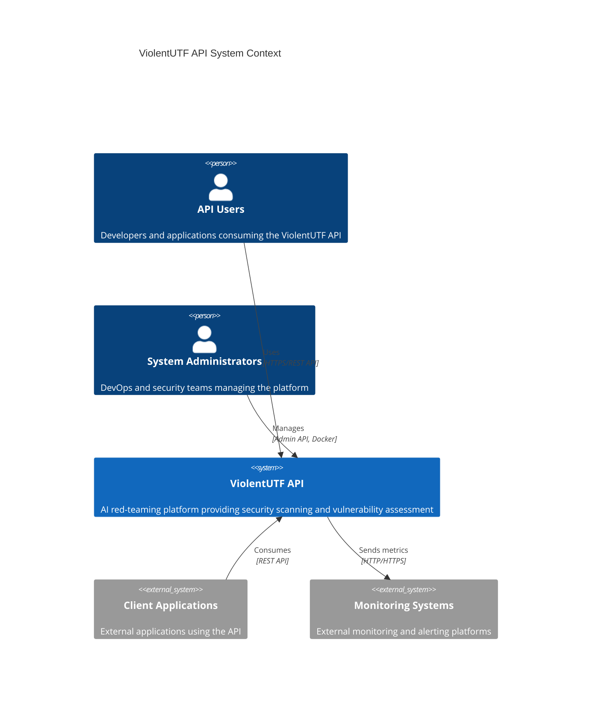
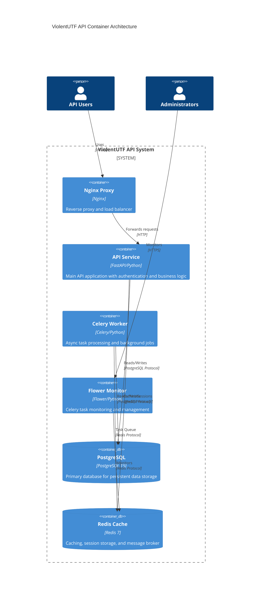
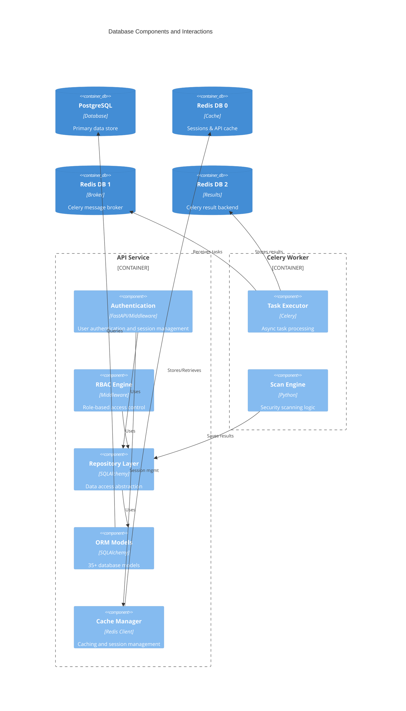
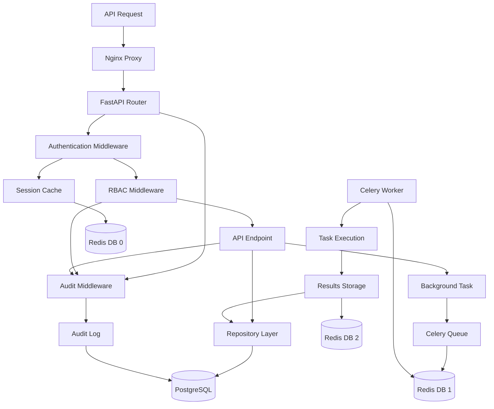
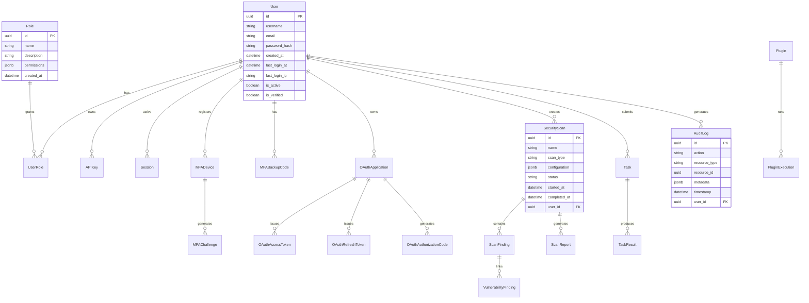
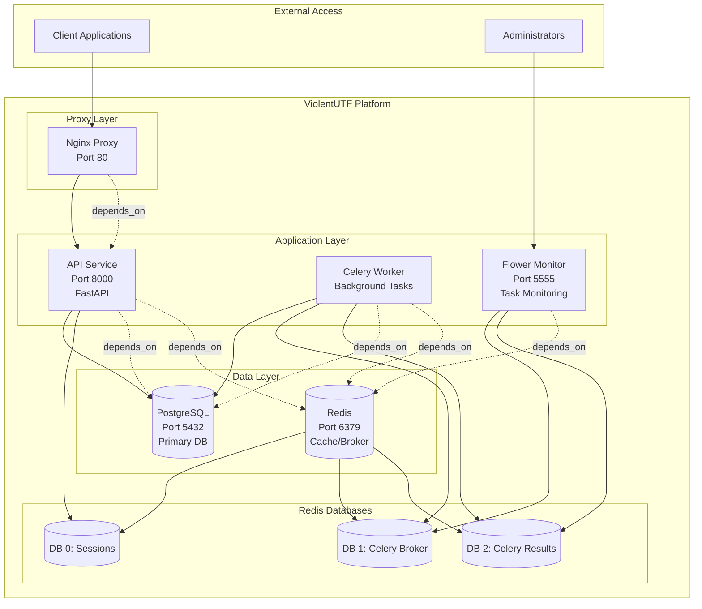
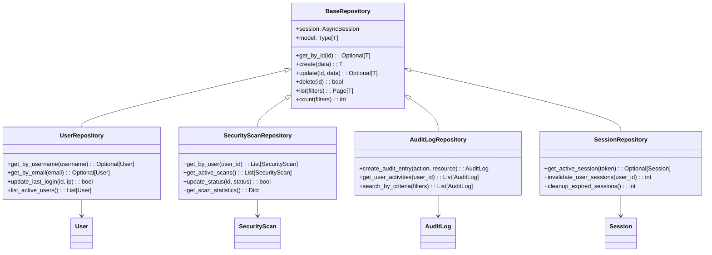
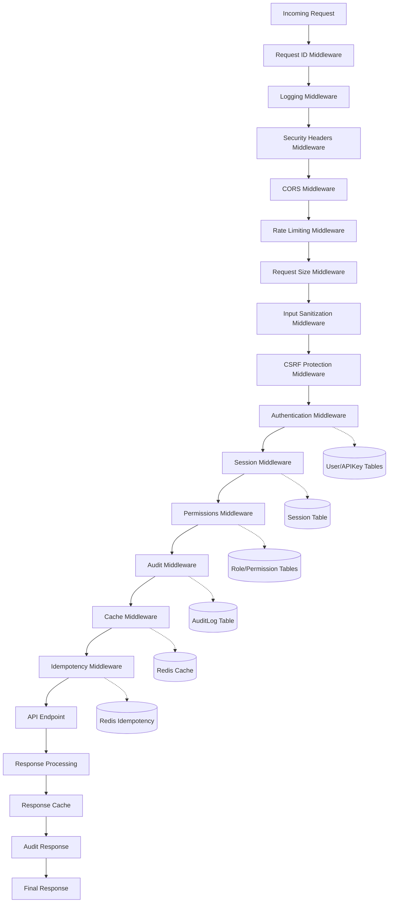
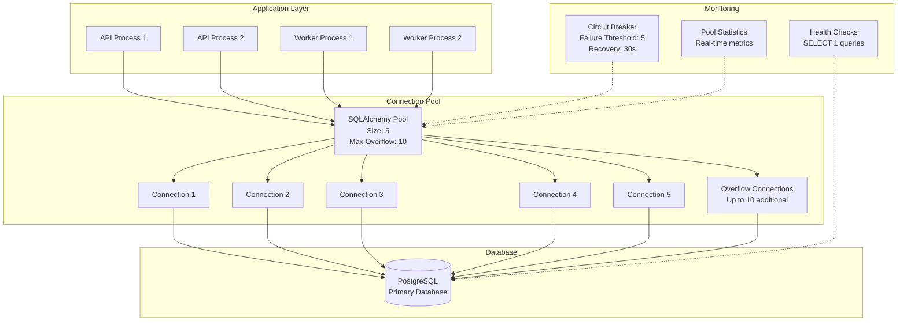
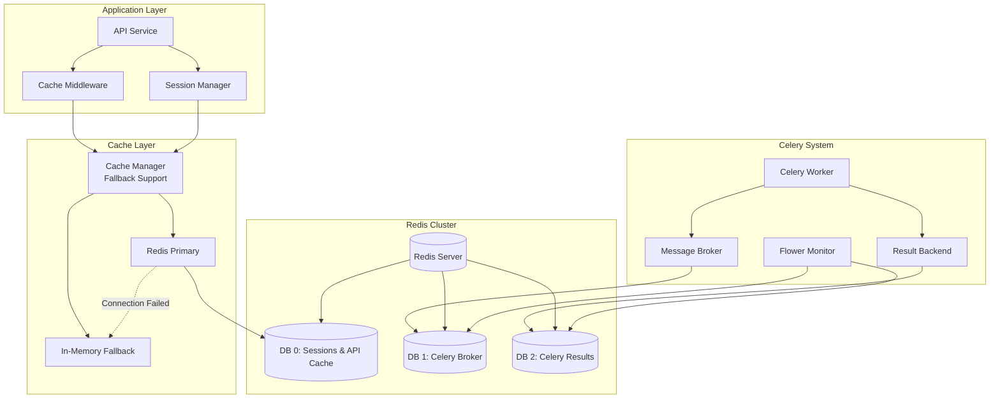

# ViolentUTF API Architecture Diagrams
## Visual Database Architecture Documentation

**Document Version**: 1.0
**Created**: September 19, 2025
**Issue**: #118 - Phase 0: Architecture Identification and Documentation

---

## System Context Diagram



---

## Container Architecture Diagram



---

## Database Component Diagram



---

## Data Flow Diagram



---

## Database Schema Overview



---

## Service Dependency Graph



---

## Repository Pattern Architecture



---

## Middleware Stack Diagram



---

## Connection Pool Architecture



---

## Cache Architecture Diagram



---

## Deployment Architecture

```mermaid
deployment
    node "Docker Host" {

        node "violentutf-network" {

            component "nginx" [
                Nginx Proxy
                --
                Image: nginx:alpine
                Port: 80
                Volume: nginx.conf
            ]

            component "api" [
                ViolentUTF API
                --
                Image: violentutf-api:latest
                Port: 8000
                Volumes: ./app, ./logs
            ]

            component "celery-worker" [
                Celery Worker
                --
                Image: violentutf-api:latest
                Command: celery worker
                Volumes: ./app, ./logs
            ]

            component "flower" [
                Flower Monitor
                --
                Image: violentutf-api:latest
                Port: 5555
                Command: celery flower
            ]

            database "postgres" [
                PostgreSQL 15
                --
                Image: postgres:15-alpine
                Volume: postgres_data
                Backup: ./backups/postgres
            ]

            database "redis" [
                Redis 7
                --
                Image: redis:7-alpine
                Volume: redis_data
                Command: redis-server --appendonly yes
            ]
        }
    }

    nginx --> api
    api --> postgres
    api --> redis
    celery-worker --> postgres
    celery-worker --> redis
    flower --> redis
```

---

## Summary

These diagrams provide a comprehensive visual representation of the ViolentUTF API database architecture, including:

1. **System Context** - High-level system interactions
2. **Container Architecture** - Service-level decomposition
3. **Database Components** - Internal component relationships
4. **Data Flow** - Request/response processing patterns
5. **Schema Overview** - Entity relationships and key tables
6. **Service Dependencies** - Inter-service communication
7. **Repository Pattern** - Data access layer architecture
8. **Middleware Stack** - Request processing pipeline
9. **Connection Pooling** - Database connection management
10. **Cache Architecture** - Caching and session management
11. **Deployment View** - Docker container orchestration

These visual representations complement the detailed analysis document and provide clear architectural understanding for stakeholders across all technical levels.

---

*Diagrams generated using Mermaid syntax for consistent rendering across documentation platforms.*
