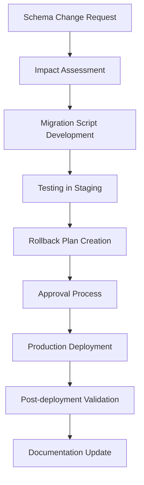

# ViolentUTF API Database Architecture Gap Analysis
## Documentation and Process Improvement Recommendations

**Document Version**: 1.0
**Analysis Date**: September 19, 2025
**Issue**: #118 - Phase 0: Architecture Identification and Documentation
**Gap Analysis Scope**: Database infrastructure, processes, and documentation

---

## Executive Summary

This gap analysis identifies areas where the ViolentUTF API database architecture lacks documentation, standardized processes, or implementation details. While the architecture demonstrates strong technical foundations, several gaps exist that should be addressed to ensure comprehensive database management and operational excellence.

### Overall Assessment
- **Architecture Maturity**: High (production-ready with enterprise patterns)
- **Documentation Coverage**: Medium (technical details present, operational procedures lacking)
- **Process Standardization**: Medium (some automation present, gaps in operational procedures)
- **Monitoring Completeness**: High (comprehensive health checks and metrics)

---

## Gap Analysis Matrix

| Category | Current State | Gap Severity | Priority | Impact |
|----------|---------------|--------------|----------|---------|
| **Backup Procedures** | Volume mounts only | HIGH | 1 | Data loss risk |
| **Disaster Recovery** | Not documented | HIGH | 1 | Business continuity |
| **Performance Baselines** | No documented benchmarks | MEDIUM | 2 | Optimization challenges |
| **Migration Rollback** | Limited procedures | MEDIUM | 2 | Deployment risk |
| **Cache Invalidation** | Implementation only | MEDIUM | 3 | Performance issues |
| **Connection Tuning** | Basic documentation | LOW | 3 | Performance optimization |

---

## High Priority Gaps (Critical)

### 1. Backup and Recovery Procedures

#### Current State
- Docker volume mounts configured: `./backups/postgres`
- PostgreSQL container has backup volume
- No documented backup procedures
- No automated backup scheduling
- No recovery testing procedures

#### Gap Details
```yaml
Missing Components:
  - Automated backup scripts
  - Backup scheduling (daily, weekly, monthly)
  - Backup validation procedures
  - Point-in-time recovery documentation
  - Backup retention policies
  - Cross-region backup strategies
  - Recovery time objectives (RTO)
  - Recovery point objectives (RPO)
```

#### Recommendations
1. **Implement Automated Backups**
   ```bash
   # Suggested backup script structure
   scripts/
   ├── backup/
   │   ├── postgres_backup.sh
   │   ├── redis_backup.sh
   │   └── backup_validation.sh
   └── recovery/
       ├── postgres_restore.sh
       └── recovery_procedures.md
   ```

2. **Create Backup Documentation**
   - Backup frequency and retention policies
   - Recovery procedures with step-by-step instructions
   - Disaster recovery runbooks
   - Backup validation checklists

3. **Establish SLAs**
   - RTO: 4 hours for critical systems
   - RPO: 1 hour maximum data loss
   - Backup retention: 30 days daily, 12 months weekly

### 2. Disaster Recovery Planning

#### Current State
- Multi-container architecture with good separation
- Health checks and circuit breakers
- No documented disaster recovery procedures
- No infrastructure as code for rapid rebuilding

#### Gap Details
```yaml
Missing Components:
  - Disaster recovery runbooks
  - Infrastructure recreation procedures
  - Data center failover plans
  - Communication protocols during outages
  - Stakeholder notification procedures
  - Business continuity documentation
```

#### Recommendations
1. **Create DR Documentation**
   ```markdown
   docs/operations/
   ├── disaster_recovery/
   │   ├── dr_runbook.md
   │   ├── infrastructure_rebuild.md
   │   ├── data_recovery_procedures.md
   │   └── communication_plan.md
   ```

2. **Implement Infrastructure as Code**
   - Terraform/Ansible for infrastructure recreation
   - Configuration management automation
   - Secret management integration

3. **Regular DR Testing**
   - Monthly DR drill procedures
   - Annual full disaster recovery testing
   - Documentation of lessons learned

---

## Medium Priority Gaps (Important)

### 3. Performance Baselines and Monitoring

#### Current State
- Connection pool statistics available
- Health check endpoints implemented
- No documented performance baselines
- No performance trend analysis
- Limited query performance monitoring

#### Gap Details
```yaml
Missing Components:
  - Database performance benchmarks
  - Query performance monitoring
  - Historical performance trends
  - Capacity planning metrics
  - Performance alerting thresholds
  - Database optimization guides
```

#### Recommendations
1. **Establish Performance Baselines**
   ```python
   # Suggested monitoring metrics
   Database Metrics:
     - Query response times (95th percentile)
     - Connection pool utilization
     - Transaction throughput
     - Cache hit rates
     - Error rates by operation type
   ```

2. **Implement Performance Monitoring**
   - Integration with existing monitoring stack
   - Custom dashboards for database metrics
   - Automated alerting for performance degradation
   - Regular performance reports

3. **Create Performance Documentation**
   ```markdown
   docs/operations/performance/
   ├── performance_baselines.md
   ├── monitoring_setup.md
   ├── optimization_guide.md
   └── capacity_planning.md
   ```

### 4. Migration and Deployment Procedures

#### Current State
- Alembic migrations configured
- Basic migration commands available
- Limited rollback procedures
- No automated migration testing

#### Gap Details
```yaml
Missing Components:
  - Migration rollback procedures
  - Migration testing automation
  - Database schema diff validation
  - Migration impact assessment
  - Blue-green deployment procedures
  - Migration approval workflows
```

#### Recommendations
1. **Enhanced Migration Procedures**
   ```bash
   # Suggested migration workflow
   tools/migration/
   ├── migration_validator.py
   ├── rollback_procedures.md
   ├── migration_testing.py
   └── deployment_checklist.md
   ```

2. **Automated Migration Testing**
   - Pre-migration schema validation
   - Post-migration data integrity checks
   - Rollback testing procedures
   - Performance impact assessment

3. **Deployment Process Documentation**
   - Step-by-step deployment procedures
   - Rollback decision criteria
   - Communication protocols
   - Approval workflows

---

## Low Priority Gaps (Improvements)

### 5. Cache Strategy Documentation

#### Current State
- Comprehensive cache implementation
- Multiple cache strategies (Redis, in-memory fallback)
- Limited cache invalidation documentation
- No cache performance optimization guide

#### Gap Details
```yaml
Missing Components:
  - Cache invalidation strategies
  - Cache warming procedures
  - Cache performance optimization
  - Cache consistency patterns
  - Cache troubleshooting guides
```

#### Recommendations
1. **Cache Strategy Documentation**
   ```markdown
   docs/architecture/caching/
   ├── cache_strategies.md
   ├── invalidation_patterns.md
   ├── performance_optimization.md
   └── troubleshooting.md
   ```

2. **Cache Management Tools**
   - Cache warming scripts
   - Cache invalidation utilities
   - Cache performance analyzers

### 6. Database Connection Optimization

#### Current State
- Connection pooling configured
- Basic pool size settings
- Limited connection optimization documentation
- No environment-specific tuning

#### Gap Details
```yaml
Missing Components:
  - Environment-specific connection tuning
  - Connection pool optimization guides
  - Database-specific configuration tuning
  - Connection monitoring best practices
```

#### Recommendations
1. **Connection Optimization Guide**
   - Environment-specific configurations
   - Load testing recommendations
   - Connection pool sizing formulas
   - Performance tuning checklists

---

## Process Improvement Recommendations

### 1. Database Change Management

#### Recommended Process


#### Implementation Steps
1. Create change request templates
2. Establish approval workflows
3. Implement automated testing
4. Document rollback procedures
5. Create deployment checklists

### 2. Database Security Audit Process

#### Recommended Security Reviews
- Quarterly access reviews
- Annual security assessments
- Vulnerability scanning integration
- Compliance audit preparation

#### Security Documentation Gaps
```yaml
Missing Security Documentation:
  - Database access control policies
  - Encryption at rest procedures
  - Security audit checklists
  - Incident response procedures
  - Compliance documentation
```

### 3. Capacity Planning Process

#### Recommended Planning Cycle
1. **Monthly**: Review growth trends
2. **Quarterly**: Capacity projections
3. **Annually**: Infrastructure planning
4. **As-needed**: Performance optimization

#### Capacity Planning Tools
- Historical data analysis scripts
- Growth projection models
- Resource utilization dashboards
- Capacity alerting systems

---

## Documentation Structure Recommendations

### Proposed Documentation Organization

```markdown
docs/
├── architecture/
│   ├── database/
│   │   ├── overview.md
│   │   ├── component_catalog.md
│   │   ├── architecture_diagrams.md
│   │   └── design_decisions.md
│   └── caching/
│       ├── cache_strategies.md
│       └── performance_optimization.md
├── operations/
│   ├── backup_recovery/
│   │   ├── backup_procedures.md
│   │   ├── recovery_procedures.md
│   │   └── disaster_recovery.md
│   ├── deployment/
│   │   ├── migration_procedures.md
│   │   ├── rollback_procedures.md
│   │   └── deployment_checklist.md
│   ├── monitoring/
│   │   ├── performance_monitoring.md
│   │   ├── health_checks.md
│   │   └── alerting.md
│   └── security/
│       ├── access_control.md
│       ├── audit_procedures.md
│       └── incident_response.md
└── development/
    ├── database_setup.md
    ├── migration_development.md
    └── testing_procedures.md
```

---

## Implementation Timeline

### Phase 1 (Immediate - 1-2 weeks)
- **High Priority Gaps**
  - Create basic backup scripts
  - Document disaster recovery procedures
  - Establish performance baselines

### Phase 2 (Short-term - 3-4 weeks)
- **Medium Priority Gaps**
  - Implement migration rollback procedures
  - Create performance monitoring setup
  - Document cache invalidation strategies

### Phase 3 (Medium-term - 6-8 weeks)
- **Process Improvements**
  - Establish change management workflows
  - Implement automated testing procedures
  - Create comprehensive operational documentation

### Phase 4 (Long-term - 10-12 weeks)
- **Optimization and Enhancement**
  - Implement advanced monitoring
  - Create capacity planning processes
  - Establish security audit procedures

---

## Success Metrics

### Documentation Completeness
- **Target**: 95% coverage of identified gaps
- **Measure**: Percentage of documented procedures
- **Timeline**: 12 weeks

### Process Automation
- **Target**: 80% of routine procedures automated
- **Measure**: Number of manual steps eliminated
- **Timeline**: 16 weeks

### Recovery Capabilities
- **Target**: 4-hour RTO, 1-hour RPO
- **Measure**: Disaster recovery test results
- **Timeline**: 8 weeks

### Performance Visibility
- **Target**: 100% of critical metrics monitored
- **Measure**: Dashboard coverage of key indicators
- **Timeline**: 6 weeks

---

## Resource Requirements

### Documentation Team
- **Technical Writer**: 0.5 FTE for 12 weeks
- **Database Administrator**: 0.25 FTE for 8 weeks
- **DevOps Engineer**: 0.25 FTE for 6 weeks

### Tool and Infrastructure Costs
- **Backup Storage**: Additional cloud storage costs
- **Monitoring Tools**: Potential licensing for advanced monitoring
- **Testing Environment**: Additional infrastructure for DR testing

### Training Requirements
- **Team Training**: Database procedures and tools
- **Documentation Training**: Writing and maintenance standards
- **Process Training**: New workflows and procedures

---

## Risk Assessment

### Risk Mitigation

| Risk | Probability | Impact | Mitigation Strategy |
|------|-------------|---------|-------------------|
| **Data Loss** | Low | High | Implement automated backups immediately |
| **Extended Downtime** | Medium | High | Create comprehensive DR procedures |
| **Performance Degradation** | Medium | Medium | Establish monitoring and baselines |
| **Migration Failures** | Medium | Medium | Implement rollback procedures |
| **Security Breaches** | Low | High | Document security procedures |

---

## Conclusion

The ViolentUTF API database architecture demonstrates strong technical implementation with comprehensive features for resilience, monitoring, and security. However, significant gaps exist in operational procedures, disaster recovery planning, and performance management documentation.

**Priority Focus Areas:**
1. **Immediate**: Backup and disaster recovery procedures
2. **Short-term**: Performance monitoring and migration processes
3. **Medium-term**: Process automation and optimization
4. **Long-term**: Advanced monitoring and capacity planning

Addressing these gaps will transform the database infrastructure from a technically sound system to a comprehensively managed, enterprise-ready platform with clear operational procedures and documented best practices.

**Estimated Effort**: 12-16 weeks with dedicated resources
**Expected ROI**: Reduced operational risk, improved reliability, faster issue resolution

---

*This gap analysis provides actionable recommendations for achieving comprehensive database infrastructure management and operational excellence.*
