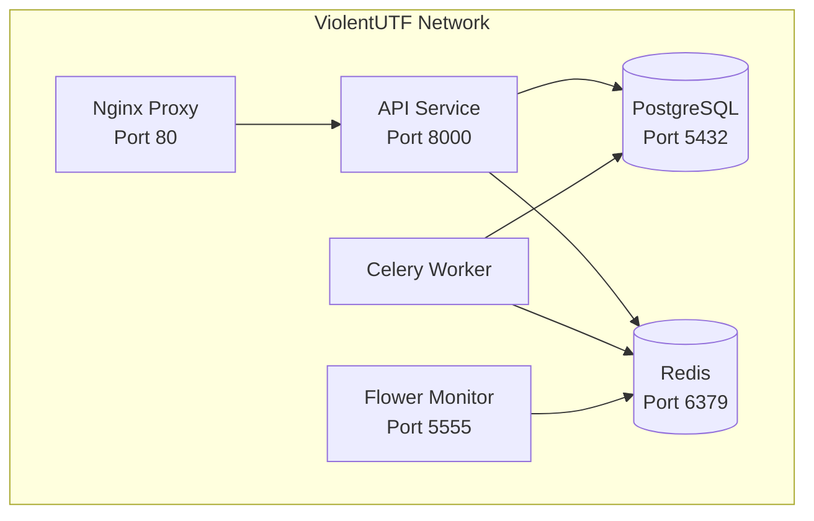
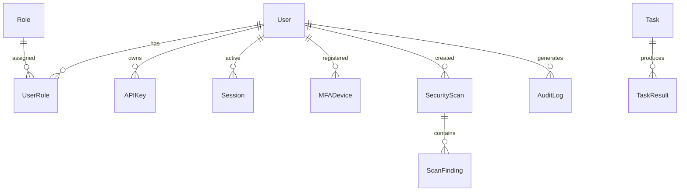

# ViolentUTF API Database Architecture Analysis
## Phase 0: Architecture Identification and Documentation

**Document Version**: 1.0
**Analysis Date**: September 19, 2025
**Issue**: #118 - Phase 0: Architecture Identification and Documentation
**Status**: Complete

---

## Executive Summary

This document provides a comprehensive analysis of the ViolentUTF API database architecture, identifying all database systems, service dependencies, and data flow patterns. The analysis reveals a well-architected microservices system with multiple database technologies and robust resilience patterns.

### Key Findings
- **6 containerized services** orchestrated via Docker Compose
- **3 database systems**: PostgreSQL (primary), Redis (cache/broker), SQLite (testing)
- **35+ SQLAlchemy models** with comprehensive relationships
- **31+ repository classes** implementing repository pattern
- **18 middleware layers** with database interactions
- **Comprehensive monitoring** and health check infrastructure

---

## Database Component Catalog

### Primary Database Systems

| Component | Type | Purpose | Configuration | Health Monitoring | Backup Strategy |
|-----------|------|---------|---------------|-------------------|-----------------|
| **PostgreSQL** | Primary | Transactional data, user management, audit logs | Pool size: 5, Max overflow: 10 | Built-in health checks | Docker volume `/backups/postgres` |
| **Redis** | Cache/Broker | Session storage, caching, Celery broker/backend | 3 databases (0-2) | Ping-based health checks | Persistent data volume |
| **SQLite** | Testing | Development/testing fallback | File-based, no pooling | File existence checks | Not applicable |

### Database Connection Configuration

```python
# From app/core/config.py Settings class
DATABASE_URL: Optional[str] = None  # PostgreSQL connection
REDIS_URL: Optional[str] = None     # Redis connection
DATABASE_POOL_SIZE: int = 5         # Connection pool size
DATABASE_MAX_OVERFLOW: int = 10     # Maximum overflow connections
```

#### Connection Pool Settings
- **Pool Size**: 5 connections (configurable via `DATABASE_POOL_SIZE`)
- **Max Overflow**: 10 additional connections (`DATABASE_MAX_OVERFLOW`)
- **Pool Timeout**: 30 seconds
- **Pool Recycle**: 3600 seconds (1 hour)
- **Pre-ping**: Enabled for connection validation

---

## Service Architecture Overview

### Docker Compose Services



### Service Dependencies

| Service | Dependencies | Database Connections | Purpose |
|---------|-------------|---------------------|---------|
| **violentutf-api** | db, redis | PostgreSQL, Redis DB 0 | Main API application |
| **violentutf-db** | None | N/A | PostgreSQL database |
| **violentutf-redis** | None | N/A | Redis cache and broker |
| **violentutf-celery-worker** | db, redis | PostgreSQL, Redis DB 1,2 | Async task processing |
| **violentutf-flower** | redis, celery-worker | Redis DB 1,2 | Task monitoring |
| **violentutf-nginx** | api | None | Reverse proxy |

---

## SQLAlchemy Models and Relationships

### Model Inventory (35 Models Identified)

#### Core Authentication & Authorization
- **User** - Primary user management
- **Role** - RBAC role definitions
- **Permission** - Granular permissions
- **UserRole** - User-role associations
- **APIKey** - API authentication tokens
- **Session** - User session management

#### Multi-Factor Authentication (MFA)
- **MFADevice** - MFA device registration
- **MFABackupCode** - Backup authentication codes
- **MFAChallenge** - Active MFA challenges
- **MFAEvent** - MFA audit events

#### OAuth Integration
- **OAuthApplication** - OAuth client applications
- **OAuthAccessToken** - Access token management
- **OAuthRefreshToken** - Refresh token management
- **OAuthAuthorizationCode** - Authorization code flow

#### Security & Scanning
- **SecurityScan** - Security scan definitions
- **Scan** - Scan execution records
- **ScanFinding** - Individual scan results
- **ScanReport** - Scan result reports
- **VulnerabilityFinding** - Vulnerability records
- **VulnerabilityTaxonomy** - Vulnerability classification

#### Task Management
- **Task** - Async task definitions
- **TaskResult** - Task execution results
- **Plugin** - Plugin management
- **PluginConfiguration** - Plugin settings
- **PluginExecution** - Plugin execution history
- **PluginRegistry** - Plugin catalog

#### Orchestration
- **OrchestratorConfiguration** - Orchestrator settings
- **OrchestratorExecution** - Execution tracking
- **OrchestratorScore** - Performance metrics
- **OrchestratorTemplate** - Execution templates

#### Reporting
- **Report** - Report definitions
- **ReportTemplate** - Report templates
- **ReportSchedule** - Scheduled reporting

#### Audit & Monitoring
- **AuditLog** - Comprehensive audit trail

### Model Relationships



---

## Repository Pattern Implementation

### Base Repository Architecture

The system implements a comprehensive repository pattern with:

- **BaseRepository** - Generic CRUD operations with pagination, filtering
- **31+ specialized repositories** - Model-specific business logic
- **Interface definitions** - Contract-based development
- **Enhanced repositories** - Advanced query capabilities

### Repository Categories

#### Authentication Repositories
- `UserRepository`
- `RoleRepository`
- `APIKeyRepository`
- `SessionRepository`

#### MFA Repositories
- `MFADeviceRepository`
- `MFABackupCodeRepository`
- `MFAChallengeRepository`
- `MFAEventRepository`

#### OAuth Repositories
- `OAuthApplicationRepository`
- `OAuthAccessTokenRepository`
- `OAuthRefreshTokenRepository`
- `OAuthAuthorizationCodeRepository`

#### Security Repositories
- `SecurityScanRepository`
- `ScanRepository`
- `VulnerabilityFindingRepository`
- `VulnerabilityTaxonomyRepository`

#### System Repositories
- `TaskRepository`
- `PluginRepository`
- `ReportRepository`
- `AuditLogRepository`
- `HealthRepository`

---

## Redis Usage Patterns

### Database Allocation

| Redis DB | Purpose | Used By | Configuration |
|----------|---------|---------|---------------|
| **DB 0** | Session storage, API caching | API Service | `REDIS_URL=redis://redis:6379/0` |
| **DB 1** | Celery broker | Celery Worker, Flower | `CELERY_BROKER_URL=redis://redis:6379/1` |
| **DB 2** | Celery result backend | Celery Worker, Flower | `CELERY_RESULT_BACKEND=redis://redis:6379/2` |

### Cache Management Features

From `app/core/cache.py`:
- **Fallback mechanism** - In-memory cache when Redis unavailable
- **Connection resilience** - Auto-retry with exponential backoff
- **JSON serialization** - Security-focused serialization (no pickle)
- **Pattern matching** - Bulk operations with pattern support
- **TTL management** - Configurable time-to-live settings

---

## Middleware Database Interactions

### Database-Connected Middleware (18 layers identified)

| Middleware | Database Usage | Purpose |
|------------|----------------|---------|
| **Authentication** | User, APIKey, Session queries | User authentication and session management |
| **Permissions** | Role, Permission queries | RBAC authorization checks |
| **Audit** | AuditLog writes | Comprehensive request/response logging |
| **Session** | Session CRUD operations | Session lifecycle management |
| **OAuth** | OAuth token validation | OAuth flow management |
| **Rate Limiting** | Redis counters | Request rate tracking |
| **Response Cache** | Redis caching | Response caching for performance |
| **Idempotency** | Redis key tracking | Duplicate request prevention |

---

## Database Session Management

### Connection Management Architecture

From `app/db/session.py`:

```python
# Circuit breaker protection
db_circuit_breaker = CircuitBreaker(
    name="database_operations",
    config=CircuitBreakerConfig(
        failure_threshold=5,
        recovery_timeout=30.0,
    ),
)

# Connection pool statistics tracking
def get_connection_pool_stats() -> Dict[str, Union[int, float]]:
    # Returns: pool_size, checked_in, checked_out, overflow, invalid, total, usage_percent
```

### Health Check Implementation

- **Database connectivity** - `SELECT 1` health checks
- **Connection validation** - Pre-ping and recovery mechanisms
- **Circuit breaker** - Automatic failure handling
- **Retry logic** - Exponential backoff for failed operations
- **Pool monitoring** - Real-time connection statistics

---

## Alembic Migration System

### Migration History

Current migrations in `/alembic/versions/`:
1. `0d9d1d5fbe10_initial_database_models_with_*.py` - Initial schema
2. `41eb10f48a60_add_last_login_at_and_last_login_ip_*.py` - User login tracking
3. `add_async_task_management_models.py` - Task management tables
4. `add_roles_field_rbac.py` - RBAC enhancements
5. `add_vulnerability_management_tables.py` - Vulnerability tracking

### Migration Management

- **Automatic initialization** - `init_db()` function in session.py
- **Fallback creation** - Direct table creation if Alembic unavailable
- **Version tracking** - Comprehensive migration history

---

## Performance and Monitoring

### Connection Pool Monitoring

Real-time metrics available via `get_connection_pool_stats()`:
- Pool size and utilization
- Active/idle connection counts
- Overflow connection usage
- Invalid connection tracking
- Usage percentage calculations

### Health Check Endpoints

- **API Health**: `/api/v1/health` - Overall service health
- **Database Health**: Built-in connectivity tests
- **Redis Health**: Ping-based availability checks
- **Celery Health**: Worker status monitoring via Flower

---

## Security Architecture

### Database Security Features

1. **Connection Security**
   - Encrypted connections (configurable)
   - Connection string masking in logs
   - Secure credential management

2. **Access Control**
   - Repository-level permissions
   - RBAC integration
   - API key authentication

3. **Audit Trail**
   - Comprehensive request logging
   - Database operation tracking
   - User action auditing

---

## Identified Architecture Strengths

1. **Resilience Patterns**
   - Circuit breaker implementation
   - Connection pool management
   - Automatic recovery mechanisms
   - Fallback cache systems

2. **Scalability Design**
   - Repository pattern for business logic
   - Async/await throughout
   - Connection pooling optimization
   - Microservices architecture

3. **Monitoring Integration**
   - Comprehensive health checks
   - Performance metrics tracking
   - Real-time connection monitoring
   - Audit trail implementation

4. **Security Framework**
   - Multi-factor authentication
   - OAuth integration
   - RBAC authorization
   - Secure session management

---

## Documentation Gaps Identified

### High Priority Gaps

1. **Data Flow Diagrams** - Missing visual representation of data flows
2. **Backup Procedures** - Documented volume mounts but no recovery procedures
3. **Performance Baselines** - No documented performance benchmarks
4. **Disaster Recovery** - Limited disaster recovery documentation

### Medium Priority Gaps

1. **Migration Rollback** - Limited rollback procedure documentation
2. **Cache Invalidation** - Cache invalidation strategies not documented
3. **Connection Tuning** - Limited connection pool tuning guidance
4. **Monitoring Dashboards** - No dashboard configuration documentation

### Low Priority Gaps

1. **Development Setup** - Limited local development database setup
2. **Testing Strategies** - Database testing patterns not fully documented
3. **Schema Evolution** - Long-term schema evolution strategy missing

---

## Recommendations for Phase 1-8

### Phase 1: Discovery & Inventory
- Focus on data sensitivity classification
- Map compliance requirements (RBAC, audit trails)
- Document data retention policies

### Phase 2: Dependency Mapping
- Deep-dive into service communication patterns
- Map critical data flow paths
- Identify single points of failure

### Phase 3: Configuration Review
- Validate connection pool sizing
- Review cache configuration strategies
- Assess backup and recovery procedures

### Subsequent Phases
- Performance optimization opportunities
- Security hardening recommendations
- Scalability planning considerations

---

## Conclusion

The ViolentUTF API demonstrates a mature, well-architected database infrastructure with comprehensive resilience patterns, monitoring capabilities, and security frameworks. The microservices architecture effectively separates concerns while maintaining data consistency through the repository pattern and proper transaction management.

Key architectural strengths include robust connection management, comprehensive audit trails, and extensive monitoring capabilities. The identified documentation gaps provide clear targets for subsequent audit phases.

**Architecture Maturity Assessment**: **High** - Production-ready with enterprise-grade patterns

---

*This analysis provides the foundation for subsequent database audit phases and serves as the architectural baseline for the ViolentUTF API database infrastructure.*
