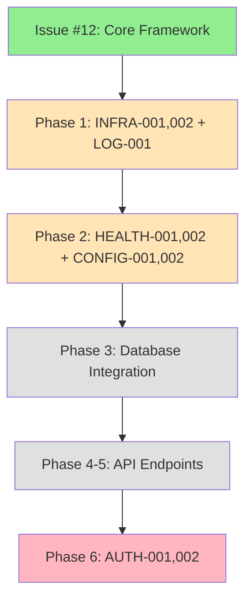

# ViolentUTF API - Issue Tracker

**Document Version**: 1.0
**Last Updated**: 2024-07-24
**Status**: Active
**Scope**: Post-Issue #12 Completion Analysis

---

## Executive Summary

This document tracks all identified issues in the ViolentUTF API codebase following the completion of Issue #12 (Core Framework Extraction). Issues are categorized by severity and mapped to the [extraction strategy phases](../planning/violentutf-api_spinoff/extraction_strategy.md) where they will be addressed.

**Current Status**: ✅ Issue #12 Complete - Core framework extracted with quality gates
**Next Phase**: Issue tracking and planned resolution timeline established

---

## Issue Classification System

### Severity Levels
- **🚨 CRITICAL**: Security vulnerabilities, system fails to start, data loss risk
- **⚠️ IMPORTANT**: Functionality impaired, monitoring affected, performance degraded
- **🔧 MINOR**: Quality improvements, documentation gaps, non-essential features
- **📋 ENHANCEMENT**: Future improvements, optimization opportunities

### Status Types
- **🔴 OPEN**: Issue identified, not yet resolved
- **🟡 IN_PROGRESS**: Actively being worked on
- **🟢 RESOLVED**: Fixed and verified
- **🔵 PLANNED**: Scheduled for future phase
- **⚪ DEFERRED**: Low priority, address when resources available

---

## Critical Issues (🚨)

### AUTH-001: Hard-coded Test Credentials
**File**: `app/api/endpoints/auth.py:45`
**Status**: 🔴 OPEN
**Severity**: 🚨 CRITICAL - Security Vulnerability
**Discovery**: Code review analysis

**Issue Description**:
```python
# Line 45 - CRITICAL SECURITY RISK
if request.username == "test" and request.password == "test":  # pragma: allowlist secret
```

**Security Impact**:
- Authentication bypass allowing unauthorized access
- Anyone can authenticate with "test/test" credentials
- Complete security control failure

**Plan Reference**: [Phase 6: Security Implementation](../planning/violentutf-api_spinoff/extraction_strategy.md#phase-6-security-implementation-week-6)
- **Resolution Timeline**: Week 6 of extraction plan
- **Implementation Notes**: Replace with JWT-based authentication system
- **Dependencies**: Requires database layer (Phase 3) completion

**Resolution Plan**:
1. Remove hard-coded credentials immediately
2. Implement JWT token generation and validation
3. Add user database models and authentication endpoints
4. Implement proper password hashing with Argon2
5. Add comprehensive authentication tests

---

### AUTH-002: Complete Authentication System Missing
**File**: `app/api/endpoints/auth.py`
**Status**: 🔴 OPEN
**Severity**: 🚨 CRITICAL - Core Functionality Missing

**Issue Description**:
- Line 1: `"""Authentication endpoints (placeholder for extraction)."""`
- Line 41: `# TODO: Implement actual user authentication`
- Line 66: `# TODO: Implement actual user registration`
- Lines 42, 67: "This is a placeholder that will be replaced in Phase 6"

**Impact**:
- No functional authentication system
- API endpoints unprotected
- User management non-existent

**Plan Reference**: [Phase 6: Security Implementation](../planning/violentutf-api_spinoff/extraction_strategy.md#component-authentication--authorization-1)
- **Resolution Timeline**: Week 6 of extraction plan
- **Implementation Notes**: Complete authentication overhaul planned
- **Improvements Planned**:
  - Replace Keycloak with JWT + API keys
  - Implement OAuth2 for third-party access
  - Add MFA support
  - Implement comprehensive audit logging

---

### INFRA-001: Database Initialization Missing
**File**: `app/main.py:43-45`
**Status**: 🔴 OPEN
**Severity**: 🚨 CRITICAL - Core Infrastructure Missing

**Issue Description**:
```python
# Lines 43-45 - CRITICAL for production
# TODO: Initialize database
# TODO: Initialize cache
# TODO: Run migrations
```

**Impact**:
- Application cannot connect to database
- Data persistence non-functional
- Migration system not integrated

**Plan Reference**: [Phase 3: Data Layer](../planning/violentutf-api_spinoff/extraction_strategy.md#phase-3-data-layer-week-3)
- **Resolution Timeline**: Week 3 of extraction plan
- **Implementation Notes**: Enhanced database setup planned
- **Improvements Planned**:
  - Connection pooling with resilience
  - Automatic retry logic
  - Strategic database indexes
  - Comprehensive model validation

**Immediate Workaround**:
- Application runs without database connectivity
- Health checks show warnings but don't fail startup

---

### INFRA-002: Application Shutdown Cleanup Missing
**File**: `app/main.py:51-52`
**Status**: 🔴 OPEN
**Severity**: 🚨 CRITICAL - Resource Management

**Issue Description**:
```python
# Lines 51-52 - CRITICAL for resource management
# TODO: Close database connections
# TODO: Close cache connections
```

**Impact**:
- Resource leaks on application shutdown
- Database connections not properly closed
- Potential connection pool exhaustion

**Plan Reference**: [Phase 1: Core Framework](../planning/violentutf-api_spinoff/extraction_strategy.md#phase-1-core-framework-extraction-week-1) - Enhancement
- **Resolution Timeline**: Week 1 enhancement (framework lifecycle)
- **Implementation Notes**: Application lifespan management planned

---

## Important Issues (⚠️)

### HEALTH-001: Database Health Check Mock Implementation
**File**: `app/api/endpoints/health.py:99`
**Status**: 🔴 OPEN
**Severity**: ⚠️ IMPORTANT - Monitoring Affected

**Issue Description**:
```python
# Line 99 - Mock implementation
# TODO: Implement actual database check
await asyncio.sleep(0.1)  # Fake delay
return True  # Always returns healthy
```

**Impact**:
- Health monitoring systems receive false positives
- Database connectivity issues not detected
- SLA monitoring compromised

**Plan Reference**: [Phase 2: Basic Functionality](../planning/violentutf-api_spinoff/extraction_strategy.md#phase-2-basic-functionality-week-2)
- **Resolution Timeline**: Week 2 of extraction plan
- **Implementation Notes**: Enhanced health checks planned
- **Improvements Planned**:
  - Comprehensive health checks with dependency monitoring
  - Readiness vs liveness probes
  - Parallel dependency checks with timeout handling

---

### HEALTH-002: Redis Health Check Mock Implementation
**File**: `app/api/endpoints/health.py:115`
**Status**: 🔴 OPEN
**Severity**: ⚠️ IMPORTANT - Monitoring Affected

**Issue Description**:
```python
# Line 115 - Mock implementation
# TODO: Implement actual Redis check
await asyncio.sleep(0.1)  # Fake delay
return True  # Always returns healthy
```

**Impact**:
- Cache connectivity issues not detected
- Performance monitoring compromised
- Cache-dependent features may fail silently

**Plan Reference**: [Phase 2: Basic Functionality](../planning/violentutf-api_spinoff/extraction_strategy.md#component-health--configuration)
- **Resolution Timeline**: Week 2 of extraction plan
- **Implementation Notes**: Real cache connectivity checks planned

---

## Minor Issues (🔧)

### LOG-001: Request Timing Not Implemented
**File**: `app/middleware/request_id.py:56`
**Status**: 🔴 OPEN
**Severity**: 🔧 MINOR - Logging Completeness

**Issue Description**:
```python
# Line 56 - Missing timing calculation
duration_ms=0,  # TODO: Add timing
```

**Impact**:
- Request performance metrics incomplete
- Debugging capabilities reduced
- SLA monitoring data missing

**Plan Reference**: [Phase 1: Core Framework](../planning/violentutf-api_spinoff/extraction_strategy.md#phase-1-core-framework-extraction-week-1) - Enhancement
- **Resolution Timeline**: Week 1 enhancement
- **Implementation Notes**: Performance monitoring middleware planned

---

### CONFIG-001: Database URL Masking Basic Implementation
**File**: `app/core/config.py:122`
**Status**: 🔴 OPEN
**Severity**: 🔧 MINOR - Security Enhancement

**Issue Description**:
```python
# Line 122 - Basic implementation note
# Simple masking - in production use proper URL parsing
```

**Impact**:
- Sensitive database credentials may be exposed in logs
- URL parsing edge cases not handled

**Plan Reference**: [Phase 2: Basic Functionality](../planning/violentutf-api_spinoff/extraction_strategy.md#component-health--configuration)
- **Resolution Timeline**: Week 2 of extraction plan
- **Implementation Notes**: Enhanced configuration management planned

---

## Configuration Requirements (📋)

### CONFIG-002: Secret Key Environment Variable Required
**File**: `app/core/config.py:30`
**Status**: 🔴 OPEN
**Severity**: 🚨 CRITICAL - Application Won't Start

**Issue Description**:
```python
# Line 30 - Required secret key not provided
SECRET_KEY: SecretStr = Field(..., min_length=32)
```

**Impact**:
- Application fails to start without SECRET_KEY environment variable
- Production deployment will fail

**Plan Reference**: [Deployment Documentation Required](../deployment/README.md)
- **Resolution Timeline**: Immediate - Documentation update needed
- **Implementation Notes**:
  - Update deployment documentation
  - Add environment variable examples
  - Include in .env.example file

---

## Resolved Issues ✅

### PRE-COMMIT-001: Code Quality Standards
**Status**: 🟢 RESOLVED
**Resolution Date**: 2024-07-24
**Resolver**: Issue #12 completion

**Issue Description**: Multiple pre-commit hook failures including:
- Type annotation missing (ANN codes)
- Code complexity violations (C901)
- Documentation formatting (D202)
- Security detection warnings

**Resolution Applied**:
- Added comprehensive type annotations to all application code
- Refactored complex functions into smaller, manageable units
- Fixed documentation formatting issues
- Added proper pragma comments for test security warnings
- Configured appropriate ignore rules for test files only

**Verification**: All pre-commit hooks now pass successfully

---

## Issue Timeline & Dependency Map

### Phase Dependencies


### Critical Path Analysis
1. **Immediate (Week 1)**: INFRA-001, INFRA-002, LOG-001
2. **Short Term (Week 2)**: HEALTH-001, HEALTH-002, CONFIG-001, CONFIG-002
3. **Medium Term (Week 3)**: Database layer implementation
4. **Long Term (Week 6)**: AUTH-001, AUTH-002 (depends on database layer)

---

## Risk Assessment

### High Risk Issues
| Issue | Risk Level | Impact | Likelihood | Mitigation |
|-------|------------|---------|------------|------------|
| AUTH-001 | 🔴 Critical | Security breach | High if deployed | Remove immediately, implement proper auth |
| AUTH-002 | 🔴 Critical | API unusable | High | Follow Phase 6 implementation plan |
| INFRA-001 | 🔴 Critical | Data loss | Medium | Database layer in Phase 3 |

### Medium Risk Issues
| Issue | Risk Level | Impact | Likelihood | Mitigation |
|-------|------------|---------|------------|------------|
| HEALTH-001 | 🟡 Medium | Monitoring blind spots | Medium | Enhanced health checks in Phase 2 |
| HEALTH-002 | 🟡 Medium | Cache issues undetected | Medium | Real connectivity checks in Phase 2 |

---

## Quality Gates

### Before Production Deployment
- [ ] AUTH-001: Hard-coded credentials removed
- [ ] AUTH-002: Proper authentication implemented
- [ ] INFRA-001: Database initialization working
- [ ] INFRA-002: Proper shutdown cleanup
- [ ] HEALTH-001,002: Real health checks implemented
- [ ] CONFIG-002: Environment setup documented

### Before Phase Completion
Each phase must verify related issues are resolved per the [extraction strategy quality gates](../planning/violentutf-api_spinoff/extraction_strategy.md#quality-gates-for-each-phase).

---

## Monitoring & Reporting

### Weekly Review
- Review new issues discovered
- Update resolution status
- Assess phase completion progress
- Update risk assessment

### Issue Metrics
- **Total Issues**: 9 (4 Critical, 2 Important, 2 Minor, 1 Configuration)
- **Resolved Issues**: 1 (PRE-COMMIT-001)
- **Critical Issues Remaining**: 4
- **Target Resolution**: Per extraction strategy timeline

---

## Contributing to Issue Resolution

### Reporting New Issues
1. Follow the issue template format above
2. Include file path and line numbers
3. Assess severity and impact accurately
4. Reference extraction strategy phases
5. Add to appropriate severity section

### Resolution Process
1. Assign issue to appropriate phase team member
2. Create detailed resolution plan
3. Implement fix following quality gates
4. Verify resolution with tests
5. Update issue status and close

---

## References

- [Extraction Strategy Document](../planning/violentutf-api_spinoff/extraction_strategy.md)
- [Issue #12 Completion Report](./ISSUE_12_COMPLETION_REPORT.md)
- [Security Notes](../security/SECURITY_NOTES.md)
- [Development README](../development/README.md)

---

**Next Review Date**: 2024-07-31
**Responsible Team**: ViolentUTF API Extraction Team
**Escalation Contact**: Project Lead for critical security issues
